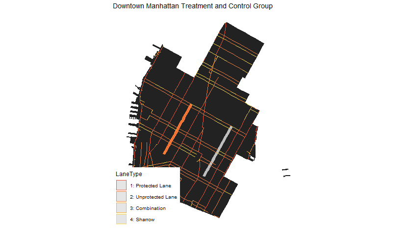
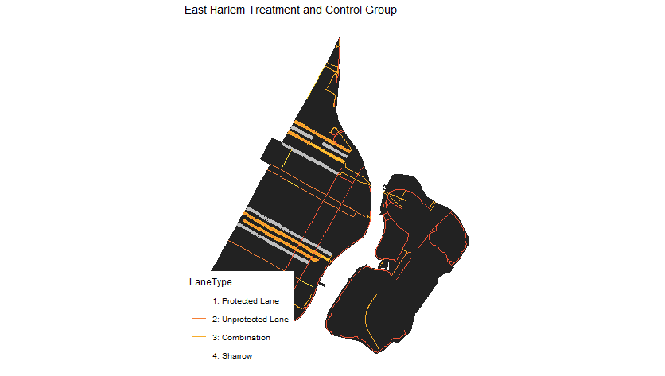

## Modeling

<br>

Q:
1)Modeling strategy <br>
2)What is your plan for generalizability

### Treatment and Control Groups

**Lower Manhattan** <br>
*Motivation*: 7th Avenue was the longest addition of new protected bikelane in 2018. 
3rd Avenue was chosen as the control because it was the only avenue without a bike lane in this area in 2018.
|Group Type|Street|Street Direction|Bike Lane Type|Date Added|Pre Period|Post Period|
|----------|------|----------------|--------------|----------|----------|-----------|
|Treatment|7th Avenue|Southbound|Protected|June 31 2018|May & June 2018|July & August 2018|
|Control|3rd Avenue|Northbound|No Bike Lane|



**East Harlem** <br>
*Motivation*: Four streets in East Harlem all got new bike lanes in 2018. This area is lower density than Chelsea and may generalize better to the rest of NYC. Control streets are other side streets in the neighborhood. 
|Group Type|Street|Street Direction|Bike Lane Type|Date Added|Pre Period|Post Period|
|----------|------|----------------|--------------|----------|----------|-----------|
|Treatment|E 128th St|Eastbound|Unprotected|Sep 31 2018|Aug & Sep 2018|Oct & Nov 2018|
|Treatment|E 126th St|Westbound|Unrpotected|Sep 31 2018|Aug & Sep 2018|Oct & Nov 2018|
|Treatment|E 110th St|Eastbound|Unrpotected|Sep 31 2018|Aug & Sep 2018|Oct & Nov 2018|
|Treatment|E 111th St|Westbound|Unrpotected|Sep 31 2018|Aug & Sep 2018|Oct & Nov 2018|
|Control|E 109th St|Westbound|No Bike Lane|
|Control|E 112th St|Eastbound|No Bike Lane|
|Control|E 127th St|Westbound|No Bike Lane|
|Control|E 124th St|Eastbound|No Bike Lane|



### Difference in Difference

<br>

#### East Harlem


|         | Pre   |  Post   |   Difference  |
|---------|------:|--------:|--------------:|
|Treatment|  325  |    405  |            	80|
|Control  |  309  |    307  |            -2 |
|Difference|	-16 |     -98 |            -82|


#### Lower Manhattan


|         | Pre   |  Post   |   Difference  |
|---------|------:|--------:|--------------:|
|Treatment|  4729  |    7046  |            	2317|
|Control  |  1809  |    2679  |              870|
|Difference|	2920 |     4367 |             1447|


<br>
<br>

### Difference in Difference over year


#### East Harlem

Using Sep18 and Sep19 as comparison:


|         | Pre   |  Post   |   Difference  |
|---------|------:|--------:|--------------:|
|Treatment|  178  |    332  |            154|
|Control  |  152  |    407  |            255|
|Difference|	-26 |      75 |            101|

<br>


### Coefficients between the number of trips and whether there is a bikelanes

<br>

Steps:

<br>
1)Aggregate monthly trip data into one
<br>
2)Slice the aggregated data into borough: Manhattan, Bronx, Brooklyn, Queens, Staten Island
<br> Inside Staten Island, there is no bike trips from March to July
<br>
3)We create a new feature called bikeland. Also, **we assume that if the bike track intersects with the bikelanes, the bike trip passes through/uses/is benefited from the bikelanes**. Therefore, if the bike track intersect with bikelanes, the value of column bikelane will be "yes", and vise versa.
<br>


```r
March2July_M <- March2July_M %>%
  mutate(bikelane = ifelse(id %in% M_inbike$id, "yes", "no"))
```

<br>
#### March to July

<br>
**Manhattan**
<br>
```r
Call:
lm(formula = count ~ bikelane, data = March2July_M)

Residuals:
             Min               1Q           Median               3Q              Max 
-0.0000000006926  0.0000000000000  0.0000000000000  0.0000000000000  0.0000000000000 

Coefficients:
                         Estimate            Std. Error            t value
(Intercept)  0.999999999998350320  0.000000000000019757 50615043211567.031
bikelaneyes -0.000000000000004092  0.000000000000020160             -0.203
                       Pr(>|t|)    
(Intercept) <0.0000000000000002 ***
bikelaneyes               0.839    
---
Signif. codes:  0 ‘***’ 0.001 ‘**’ 0.01 ‘*’ 0.05 ‘.’ 0.1 ‘ ’ 1

Residual standard error: 0.00000000000165 on 176230 degrees of freedom
Multiple R-squared:    0.5,	Adjusted R-squared:    0.5 
F-statistic: 1.762e+05 on 1 and 176230 DF,  p-value: < 0.00000000000000022
```


<br>
<br>
Questions:
1) For now, like the new lanes added in 2018c, we assume the lane is added at Sep 2018, and then use the Aug, Sep, Oct, and Nov to do previous and post comparison. We are wondering is the assumption acceptable? Or?
2) Would our controls be ok?
3) Question about normalizing data
4) BoxR-->cannot read shp file

