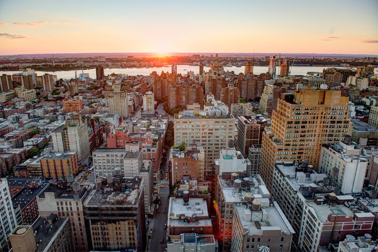
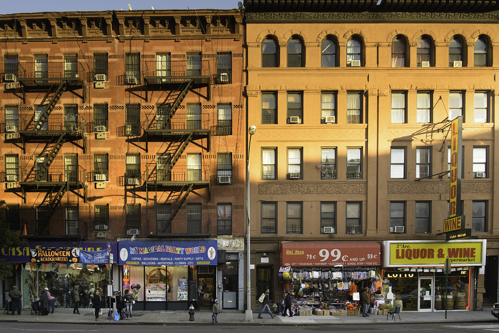
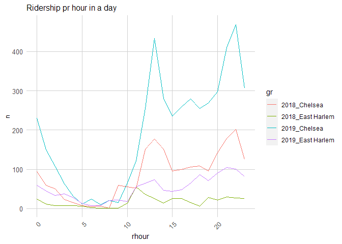
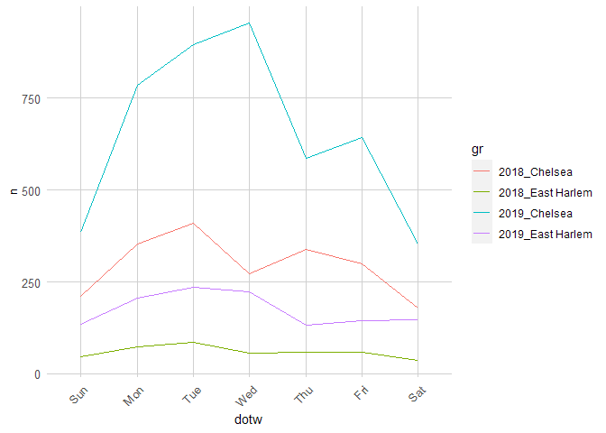
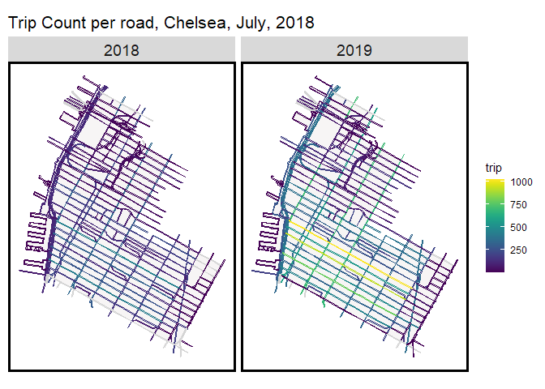
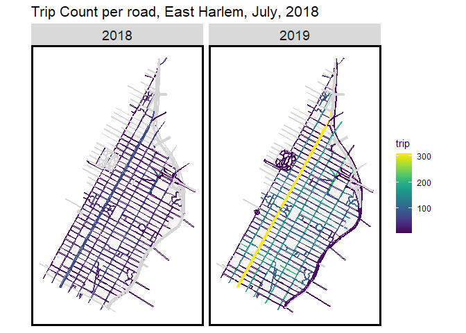
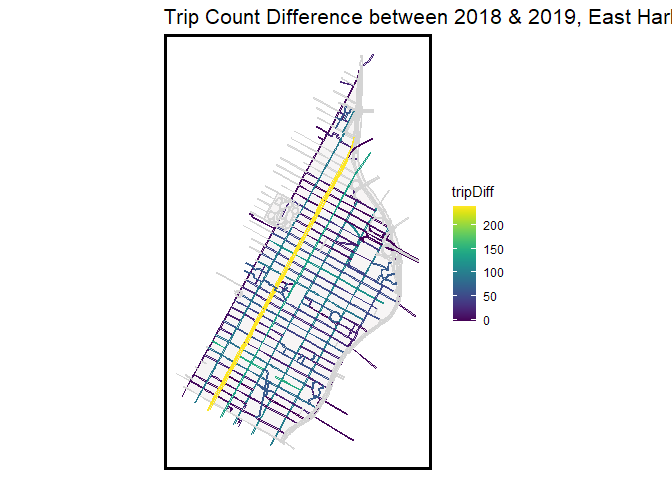
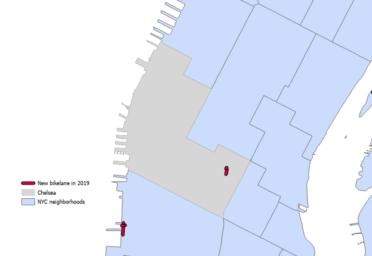
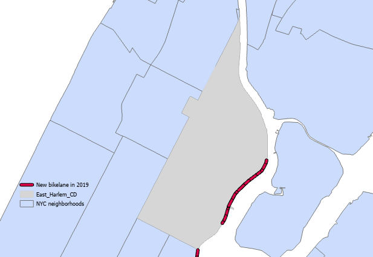

Pre1\_xtl
================
Xintian Stella Li
2/21/2021

### Chelsea & East Harlem

In the part, we select two neighborhoods to see their bike ridership
trends in July 2018 and 2019. The first neighborhood is Chelsea, and the
second is East Harlem. Chelsea lies on the west side of Manhattan
borough. It is a typical representative of Manhattan, which has a high
density built environment, large population, and highly diversed art and
culture. East Harlem is more residential, we pick this neighborhood
because it may be more similar to other residential boroughs in the NYC.

We use trip data in July for this part, because that weather in July is
most suitable for biking.

| Chelsea                     | East Harlem          |
| --------------------------- | -------------------- |
|  |  |

First, Let’s see the ridership trend by hour and by day. As shown in the
plots below, ridership in both neighborhood increase from 2018 to 2019.
The ridership in Chelsea is much higher than that in East Harlem and the
daily peaks are more obvious. Also, the frequency of bike use in a month
increase.

``` r
grid.arrange(
  ggplot(chel_07_2018 %>% 
           st_drop_geometry() %>%
           mutate(time = ymd_hms(rcrd_tm),
                  interval60 = floor_date(time,unit = "hour")) %>% 
           select(-time) %>% group_by(interval60) %>% tally() %>% 
           mutate(year = 2018))+geom_line(aes(x=interval60,y=n))+
    labs(title = "Ridership pr hour pr day, Chelsea, July,2018")+plotTheme,
  ggplot(chel_07_2019 %>% 
           st_drop_geometry() %>%
           mutate(time = ymd_hms(rcrd_tm),
                  interval60 = floor_date(time,unit = "hour")) %>% 
           select(-time) %>% group_by(interval60) %>% tally() %>% 
           mutate(year = 2019))+geom_line(aes(x=interval60,y=n))+
    labs(title = "Ridership pr hour pr day, Chelsea, July,2019")+plotTheme,
  ggplot(Har_07_2018 %>% 
           st_drop_geometry() %>%
           mutate(time = ymd_hms(rcrd_tm),
                  interval60 = floor_date(time,unit = "hour")) %>% 
           select(-time) %>% group_by(interval60) %>% tally() %>% 
           mutate(year = 2018))+geom_line(aes(x=interval60,y=n))+
    labs(title = "Ridership pr hour pr day, East Harlem, July,2018")+plotTheme,
  ggplot(Har_07_2019 %>% 
           st_drop_geometry() %>%
           mutate(time = ymd_hms(rcrd_tm),
                  interval60 = floor_date(time,unit = "hour")) %>% 
           select(-time) %>% group_by(interval60) %>% tally() %>% 
           mutate(year = 2019))+geom_line(aes(x=interval60,y=n))+
    labs(title = "Ridership pr hour pr day, East Harlem, July,2019")+plotTheme
)
```

<!-- --> The graph below
shows the hourly ridership in a day. This plot shows that in Chelsea,
the morning peak hour is around 11 am and the night peak hour is around
10 pm. The daily periodicity become more obvious in 2019, which may
indicate that more people use bike to commute to work in their daily
life. However, although the ridership in East Harlem also increase,
there is no obvious periodicity.

``` r
# bike ridership by hour 
ggplot(rbind(
  chel_07_2018 %>%
         st_drop_geometry() %>%
         group_by(rhour) %>% tally() %>%
    mutate(year = "2018",
           neighborhood = "Chelsea",
           gr = paste(year,neighborhood,sep = "_")),
  chel_07_2019 %>%
    st_drop_geometry() %>%
    group_by(rhour) %>% tally() %>%
    mutate(year = "2019",
           neighborhood = "Chelsea",
           gr = paste(year,neighborhood,sep = "_")),
  Har_07_2018 %>%
    st_drop_geometry() %>%
    group_by(rhour) %>% tally() %>%
    mutate(year = "2018",
           neighborhood = "East Harlem",
           gr = paste(year,neighborhood,sep = "_")),
  Har_07_2019 %>%
    st_drop_geometry() %>%
    group_by(rhour) %>% tally() %>%
    mutate(year = "2019",
           neighborhood = "East Harlem",
           gr = paste(year,neighborhood,sep = "_"))))+
    geom_line(aes(x=rhour,y = n, group = gr,color = gr,binwidth = 1))+plotTheme+
  labs(title="Ridership pr hour in a day")
```

    ## Warning: Ignoring unknown aesthetics: binwidth

<!-- --> This plot
shows bike ridership by the day of week.The peak bicycle use does not
occur on weekends in both neighborhoods.

``` r
# bike ridership by day of week
ggplot(rbind(
  chel_07_2018 %>%
    st_drop_geometry() %>%
    mutate(dotw = wday(rcrd_tm,label = T)) %>% 
    group_by(dotw) %>% tally() %>%
    mutate(year = "2018",
           neighborhood = "Chelsea",
           gr = paste(year,neighborhood,sep = "_")),
  chel_07_2019 %>%
    st_drop_geometry() %>%
    mutate(dotw = wday(rcrd_tm,label = T)) %>% 
    group_by(dotw) %>% tally() %>%
    mutate(year = "2019",
           neighborhood = "Chelsea",
           gr = paste(year,neighborhood,sep = "_")),
  Har_07_2018 %>%
    st_drop_geometry() %>%
    mutate(dotw = wday(rcrd_tm,label = T)) %>% 
    group_by(dotw) %>% tally() %>%
    mutate(year = "2018",
           neighborhood = "East Harlem",
           gr = paste(year,neighborhood,sep = "_")),
  Har_07_2019 %>%
    st_drop_geometry() %>%
    mutate(dotw = wday(rcrd_tm,label = T)) %>% 
    group_by(dotw) %>% tally() %>%
    mutate(year = "2019",
           neighborhood = "East Harlem",
           gr = paste(year,neighborhood,sep = "_"))))+
  geom_line(aes(x=dotw,y = n, group = gr,color = gr,binwidth = 1))+plotTheme
```

    ## Warning: Ignoring unknown aesthetics: binwidth

<!-- --> Next, we
study the ridership changes in two boroughs seperately.

This graph compares the ridership in Chelsea in two years. As you can
see, the increase of ridership mainly happens in the south west part of
the neighborhood. For example, the west 22 ST had a monthly ridership of
1020 in 2019. The riverside roads also see an obvious increase in these
two years.

``` r
# bike trip in 2018.2019, Chelsea and East Harlem
chel18 <- road15_chel %>% 
  select(Street,trip18,geometry) %>% 
  mutate(Year = 2018) %>% 
  rename(trip=trip18)

chel19 <- road15_chel %>% 
  select(Street,trip19,geometry) %>% 
  mutate(Year = 2019) %>% 
  rename(trip=trip19)

har18 <- road15_har %>% 
  select(Street,trip18,geometry) %>% 
  mutate(Year = 2018) %>% 
  rename(trip=trip18)

har19 <- road15_har %>% 
  select(Street,trip19,geometry) %>% 
  mutate(Year = 2019) %>% 
  rename(trip=trip19)

har_Diff1819 <- road15_har %>% 
  select(Street,trip18,trip19,geometry) %>% 
  mutate(tripDiff = trip19-trip18) %>% 
  select(-trip18,-trip19)

har_Diff1819 <- road15_har %>% 
  select(Street,trip18,trip19,geometry) %>% 
  mutate(tripDiff = trip19-trip18) %>% 
  select(-trip18,-trip19)

har_Diff1819 <- road15_har %>% 
  select(Street,trip18,trip19,geometry) %>% 
  mutate(tripDiff = trip19-trip18,
         Neighborhood = "East Harlem") %>% 
  select(-trip18,-trip19) 

chel_Diff1819 <- road15_chel %>% 
  select(Street,trip18,trip19,geometry) %>% 
  mutate(tripDiff = trip19-trip18,
         Neighborhood = "Chelsea") %>% 
  select(-trip18,-trip19) 

#Chelsea
ggplot() + 
  geom_sf(data = chelsea,fill = "#f7f5f5",col = NA)+
  geom_sf(data = rbind(chel18,chel19),aes(color = trip))+
  scale_color_viridis(direction = 1,
                      discrete = F, option = "viridis",
                      na.value = "#D4D4D4")+
  labs(title = "Trip Count per road, Chelsea, July, 2018") + facet_wrap(~Year)+ mapTheme()
```

<!-- --> This map
visualize the difference from 2018 to 2019. Although most roads see
increase from two years. There are some road where the ridership drops
in 2019. For instance, the west 16th st, had a drop of 101 ridership in
July. The ridership in west 25th and 36th st also dropped.

``` r
# Diff in two years
ggplot()+
  geom_sf(data = chelsea,fill = "#f7f5f5",col = NA)+
  geom_sf(data = chel_Diff1819,aes(color = tripDiff))+
  scale_color_viridis(direction = 1,
                      discrete = F, option = "viridis",
                      na.value = "#D4D4D4")+
  labs(title = "Trip Count Difference between 2018 & 2019, Chelsea") +
  mapTheme()
```

<!-- --> In East
Harlem, the ridership and the increase in ridership are more
concentrated on several roads. The PARK AVENUE has the highest ridership
of 311 in July, 2019. Other connecting roads around park avenue also see
increase in bike ridership, however, the increase is relatively small
compared with that on Park Avenue.

``` r
#East Harlem
ggplot() + 
  geom_sf(data = eastHarlem,fill = "#f7f5f5",col = NA)+
  geom_sf(data = rbind(har18,har19),aes(color = trip))+
  scale_color_viridis(direction = 1,
                      discrete = F, option = "viridis",
                      na.value = "#D4D4D4")+
  labs(title = "Trip Count per road, East Harlem, July, 2018") +
  facet_wrap(~Year)+
  mapTheme()
```

<!-- -->

``` r
ggplot()+
  geom_sf(data = eastHarlem,fill = "#f7f5f5",col = NA)+
  geom_sf(data = har_Diff1819,aes(color = tripDiff))+
  scale_color_viridis(direction = 1,
                      discrete = F, option = "viridis",
                      na.value = "#D4D4D4")+
  labs(title = "Trip Count Difference between 2018 & 2019, East Harlem") +
  mapTheme()
```

<!-- --> There is
few added bike lanes in these two neiborhoods in 2019. We will study the
relationship between the riderhsip increase and the newly added bike
lanes in the next steps. 

